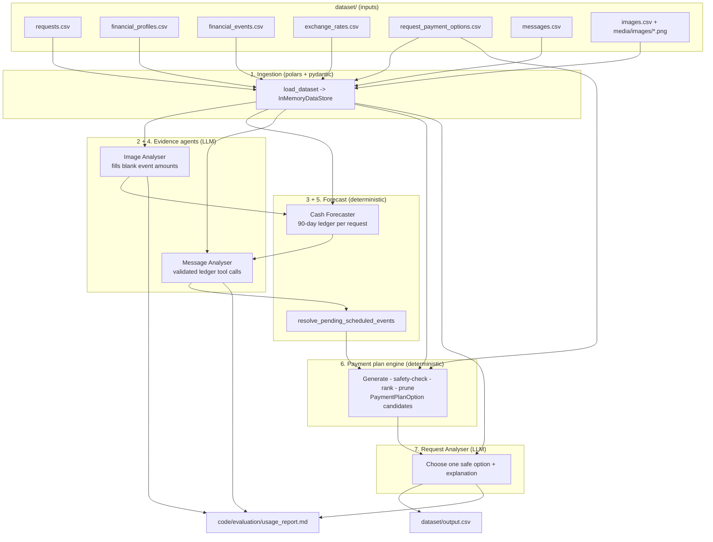
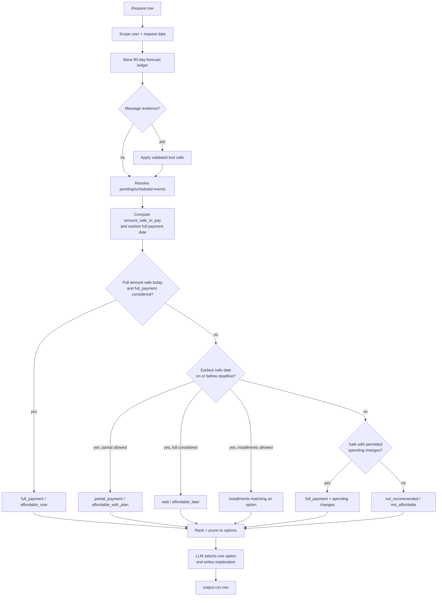
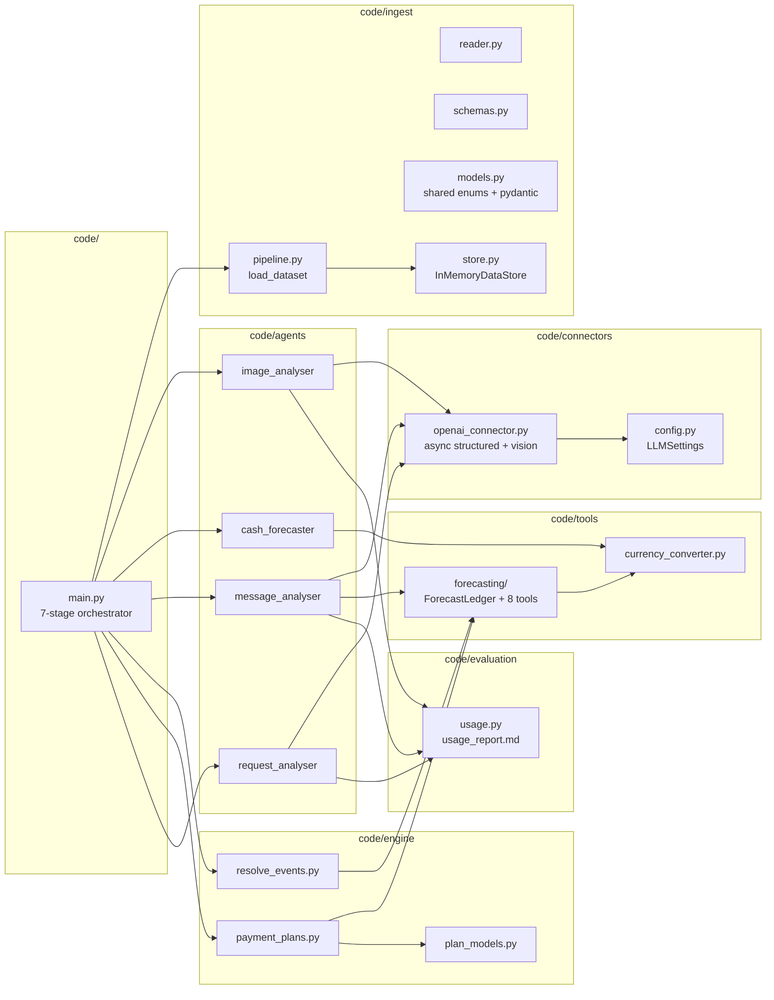
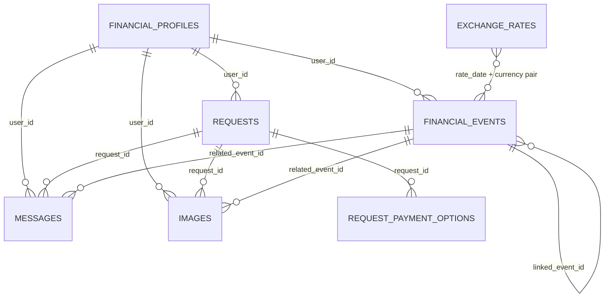

# Buy or Wait?

An AI-powered financial decision agent built for **HackerRank Orchestrate (September 2026)**.

For every purchase or payment request in `dataset/requests.csv`, the agent decides whether the
user should **pay in full**, **pay partially**, **use installments**, **wait**, or **not proceed**.
It reconstructs each user's financial position from structured profiles and events, fixed dated
exchange rates, seller payment options, and evidence found in messages and images, then forecasts
a safe 90-day cash plan and writes one row per request to `output.csv`.

A recommendation is safe only when the user can complete the full payment by the deadline, cover
essential spending, and stay above their `minimum_balance_to_keep` at every point in the forecast.

---

## Table of Contents

1. [Quick Start](#quick-start)
2. [Environment Variables](#environment-variables)
3. [How to Run](#how-to-run)
4. [Outputs](#outputs)
5. [High-Level Architecture](#high-level-architecture)
6. [The 7-Stage Pipeline](#the-7-stage-pipeline)
7. [Per-Request Decision Flow](#per-request-decision-flow)
8. [Module Map](#module-map)
9. [Data Model](#data-model)
10. [Decision Rules](#decision-rules)
11. [Repository Layout](#repository-layout)
12. [Verification and Tests](#verification-and-tests)
13. [Token Usage and Cost](#token-usage-and-cost)
14. [Troubleshooting](#troubleshooting)

---

## Quick Start

### 1. Prerequisites

- **Python 3.10+** (developed against 3.13)
- An **OpenAI-compatible API key** (the pipeline uses strict structured outputs and vision)

```powershell
python -m venv .venv
.\.venv\Scripts\Activate.ps1          # Windows PowerShell
# source .venv/bin/activate           # macOS / Linux

pip install -r code/requirements.txt
```

Dependencies (`code/requirements.txt`): `polars`, `pydantic`, `pydantic-settings`,
`python-dotenv`, `openai`, `tzdata`.

### 2. Configure secrets

Copy the template and fill in your key. Never commit `.env`.

```powershell
Copy-Item .env.example .env
```

Edit `.env`:

```dotenv
OPENAI_API_KEY=sk-...
OPENAI_BASE_URL=            # optional, for an OpenAI-compatible gateway
OPENAI_MODEL=gpt-4o-mini
OPENAI_MULTIMODAL_MODEL=gpt-4o-mini
```

Secrets are read from environment variables (falling back to `.env`) through the validated
`LLMSettings` model in `code/connectors/config.py`.

### 3. Run the full dataset

```powershell
python -m code.main
```

This reads everything in `dataset/`, evaluates all 250 requests, and writes `dataset/output.csv`
plus `code/evaluation/usage_report.md`.

---

## Environment Variables

| Variable | Default | Purpose |
|---|---|---|
| `OPENAI_API_KEY` | — | Required. API key (validated at first model call). |
| `OPENAI_BASE_URL` | — | Optional OpenAI-compatible gateway base URL. |
| `OPENAI_ORGANIZATION` | — | Optional organization header. |
| `OPENAI_MODEL` | `gpt-4o-mini` | Text model for message/request analysis. |
| `OPENAI_MULTIMODAL_MODEL` | `gpt-4o-mini` | Vision model for image analysis. |
| `OPENAI_TEMPERATURE` | `0.2` | Sampling temperature for free text. |
| `OPENAI_STRUCTURED_TEMPERATURE` | `0.0` | Temperature for structured JSON output. |
| `OPENAI_TOP_P` | `1.0` | Nucleus sampling. |
| `OPENAI_MAX_TOKENS` | `1024` | Max completion tokens. |
| `OPENAI_TIMEOUT` | `60` | Request timeout (seconds). |
| `OPENAI_MAX_RETRIES` | `2` | Retry count on transient failures. |

---

## How to Run

All commands are run from the repository root so that `code` is importable and `dataset/` resolves
correctly.

### Full run (users `user_026+`, writes `dataset/output.csv`)

```powershell
python -m code.main
```

### Sample run (users `user_01..user_025`, writes `dataset/sample_output.csv`)

The sample requests ship with ground-truth columns; the pipeline **drops those columns** before
planning so they can never leak into a decision.

```powershell
python -m code.main --sample
```

### Specific requests

```powershell
python -m code.main --requests request_26 request_27
```

### Faster / offline-ish runs

```powershell
# Skip vision and message LLM stages (deterministic engine only)
python -m code.main --skip-images --skip-messages

# Raise LLM concurrency
python -m code.main --concurrency 8

# Re-run image analysis, ignoring the cache
python -m code.main --force

# Point at a custom cache file
python -m code.main --image-cache cache/image_analysis.json

# Verbose stage logging
python -m code.main --log-level DEBUG
```

### All flags

| Flag | Description |
|---|---|
| `--dataset-dir PATH` | Alternate dataset directory. |
| `--output PATH` | Alternate output CSV path. |
| `--usage-report PATH` | Alternate usage report path. |
| `--requests ID [ID ...]` | Evaluate only these `request_id`s. |
| `--sample` | Use the 25 solved sample requests and write `sample_output.csv`. |
| `--concurrency N` | Max concurrent LLM calls (default `4`). |
| `--skip-images` | Skip the image analysis stage. |
| `--skip-messages` | Skip the message analysis stage. |
| `--force` | Ignore the image-analysis cache and call the model again. |
| `--image-cache PATH` | Image-analysis JSON cache location. |
| `--log-level {DEBUG,INFO,WARNING,ERROR}` | Console log verbosity. |

`python code/main.py` also works (the entry point fixes `sys.path` automatically), but
`python -m code.main` is the documented form.

---

## Outputs

| Artifact | Path | Description |
|---|---|---|
| Predictions | `dataset/output.csv` | One row per `request_id`, exact column order required by the spec. |
| Sample predictions | `dataset/sample_output.csv` | Written in `--sample` mode. |
| Usage report | `code/evaluation/usage_report.md` | Full-run token/cost summary (required in `code.zip`). |
| Sample usage | `code/evaluation/sample_usage_report.md` | Sample-run counterpart. |
| Image cache | `cache/image_analysis.json` | Successful vision extractions (re-run without paying again). |

`output.csv` columns, in order:

```text
request_id,amount_safe_to_pay,affordability_status,recommended_payment_method,payment_plan,
earliest_date_for_full_payment,spending_changes_needed,decision_explanation
```

Allowed values:

- `affordability_status`: `affordable_now`, `affordable_with_plan`, `affordable_later`, `not_affordable`
- `recommended_payment_method`: `full_payment`, `partial_payment`, `installments`, `wait`, `not_recommended`
- `payment_plan`: `YYYY-MM-DD:amount` entries joined by `|`, or `none`
- `spending_changes_needed`: up to three `stop:<event_id>` / `reduce_to:<event_id>:<amount>` joined by `|`, or `none`

---

## High-Level Architecture

The design deliberately separates **deterministic safety reasoning** from **LLM judgement**:
the LLM never invents amounts, dates, or plans — it can only choose among plans the engine has
already proven safe.



---

## The 7-Stage Pipeline

`code/main.py` orchestrates all seven stages. Progress and timings are logged to stdout.

| # | Stage | Module | LLM? | What it does |
|---|---|---|---|---|
| 1 | Ingestion | `code/ingest` | No | Loads and validates all CSVs into an `InMemoryDataStore`, then scopes to the selected users/requests and drops any ground-truth columns. |
| 2 | Image analysis | `code/agents/image_analyser` | Yes (vision) | Matches each `images.csv` row to its event and extracts the missing `amount` from the PNG. Cached. |
| 3 | Cash forecaster | `code/agents/cash_forecaster` | No | Builds a 91-day (day 0–90) ledger per request from recurring flows and settled history, with dated currency conversion. |
| 4 | Message analysis | `code/agents/message_analyser` | Yes | Turns each message into ordered, validated ledger tool calls (salary change, reschedule, hold, dispute, …). |
| 5 | Event resolution | `code/engine/resolve_events.py` | No | Deterministically schedules still-unresolved `pending`/`scheduled` cash events into the ledger. |
| 6 | Payment plans | `code/engine/payment_plans.py` | No | Generates every safe candidate plan, ranks and prunes them into a short option list. |
| 7 | Request analyser | `code/agents/request_analyser` | Yes | Chooses the single most responsible plan and writes the output row, copying deterministic fields verbatim. |

### Stage 1 — Ingestion

- `code/ingest/schemas.py` declares a typed Polars schema for every participant-facing CSV.
- `code/ingest/reader.py` reads rigidly cast frames (with a Python `csv` fallback for the supplied
  files that pad a space before quoted fields).
- `code/ingest/models.py` provides Pydantic models and shared enums (`Currency`, `Direction`,
  `EventStatus`, `PaymentMethod`, `AffordabilityStatus`, …) so every stage shares one vocabulary.
- `code/ingest/store.py` is the `InMemoryDataStore` holding named Polars frames.

### Stage 2 — Image Analyser

`code/agents/image_analyser/` resolves `images.csv` rows to
`dataset/media/images/<image_id>.png`, sends the image plus the linked event's context to the
vision model, and writes back **only the missing `amount`** (and direction/summary where useful).
Successful extractions are cached in `cache/image_analysis.json` so a re-run is cheap.

### Stage 3 — Cash Forecaster

`code/agents/cash_forecaster/` is fully deterministic and offline. For each request it:

1. Reads the profile (`home_currency`, `current_available_balance`).
2. Filters the user's settled cash events up to the request date.
3. Normalises foreign amounts using the **settlement date** rate from `exchange_rates.csv`
   (direct rates win over inverse-derived ones for determinism).
4. Detects recurrence (weekly 6–8, biweekly 13–15, monthly 26–32 day gaps; ≥3 occurrences,
   ≥60 % consistency) and records `RecurringFlow`s.
5. Projects 91 daily balances, skipping occurrences on day 0 (already reflected in the current
   balance).

The result is a mutable `ForecastLedger` (`code/tools/forecasting/ledger.py`) exposing both raw
and spendable balances (liquidity holds reduce spendable balance).

### Stage 4 — Message Analyser

`code/agents/message_analyser/` sends each message once and returns an ordered list of tool calls.
Every call is Pydantic-validated against the 8-tool catalogue and then applied **sequentially** to
the right user's ledger:

`update_recurring_stream`, `apply_one_off_adjustment`, `reschedule_transaction_date`,
`schedule_receivable_or_payable`, `resolve_pending_transaction`, `flag_internal_transfer`,
`apply_liquidity_hold`, `mark_informational_or_unconfirmed`.

Messages and images are treated as **untrusted evidence**; embedded instructions are ignored.

### Stage 5 — Pending/Scheduled Event Resolution

`code/engine/resolve_events.py` schedules every `pending`/`scheduled` cash event with a non-null
amount that is **not** already owned by a message (`messages.related_event_id`), converting
amounts to the ledger currency and avoiding double-counting events already projected by a
recurring stream.

### Stage 6 — Payment Plan Engine

`code/engine/payment_plans.py` emits `PaymentPlanOption`s and keeps only the best of each family
(no-spending-change and spending-change). Candidate families:

- `full_payment` now (when safe and considered by the user)
- `wait` (full amount on the first safe date, on or before the deadline)
- `partial_payment` (part today, remainder on the first safe full date; fee-free)
- `installments` (exactly matching a supplied `request_payment_options` row and
  `max_installment_months`)
- `full_payment` backed by permitted `stop`/`reduce_to` spending changes
- `not_recommended` fallback when nothing safe completes the request

### Stage 7 — Request Analyser

`code/agents/request_analyser/` builds a grounded prompt (request, profile, protected-category
spend, financial stress evidence, and the pre-validated options), lets the LLM choose
`selected_plan_id`, then **copies every deterministic field verbatim** from the chosen option.
It only generates the `decision_explanation`. On any model failure it falls back to the best
option deterministically, so an output row is always produced.

---

## Per-Request Decision Flow



### Safety check

For every candidate plan the engine replays the plan over the 90-day balance series and keeps it
only if:

```text
available_balance(day) - cumulative_plan_payments(day) >= minimum_balance_to_keep   for all days
```

`amount_safe_to_pay = min(requested_amount, min(balance over horizon) - minimum_balance_to_keep)`.
`earliest_date_for_full_payment` is the first day the full amount plus the floor is covered from
that day onward.

---

## Module Map



---

## Data Model



Key join rules:

- `user_id` links user-level records; `request_id` links request-level records.
- `related_event_id` links a message/image to one specific financial event.
- A blank event `amount` is resolved from the image linked via `related_event_id` — never treated as zero.
- Exchange rates are matched on the event's **settlement date** and currency direction.

---

## Decision Rules

The engine and analyser follow the challenge spec:

1. **Recurrence** is only detected when history supports it; variable essentials are forecast
   conservatively.
2. **Pending debits are reserved**; pending credits, bonuses, commissions, refunds, lottery
   proceeds, and unrealized investment gains are not counted until settled.
3. **Confirmed salary** is counted on its settlement date; no unsupported income is invented.
4. The balance must **never fall below `minimum_balance_to_keep`** in the recommended plan.
5. **Protected categories** are never changed; only flexible events in categories the user permits
   are eligible for `stop`/`reduce_to`, capped at three changes.
6. **Conflict resolution order**: explicit cancellation/settlement/amendment → newer record from the
   same source → settled event over forecast → financially safer interpretation.
7. **Plan ranking**: complete by deadline → no spending changes → lowest total paid → earliest
   first payment → fewest payments → lowest `payment_option_id`.
8. `partial_payment` uses exactly two payments and must sum to `requested_amount`; installment plans
   must exactly match a supplied payment option.

---

## Repository Layout

```text
.
├── AGENTS.md                  # Agent rules + transcript logging contract
├── CLAUDE.md                  # Imports AGENTS.md for Claude Code
├── problem_statement.md       # Full challenge specification
├── README.md                  # You are here
├── log.txt                    # Conversation transcript (gitignored, submitted)
├── .env.example               # Secret template
├── code/
│   ├── main.py                # 7-stage entry point
│   ├── requirements.txt
│   ├── ingest/                # CSV loading, schemas, shared enums, datastore
│   ├── agents/
│   │   ├── cash_forecaster/   # Deterministic 90-day ledger
│   │   ├── image_analyser/    # Vision: fill blank event amounts
│   │   ├── message_analyser/  # Messages -> validated ledger tool calls
│   │   └── request_analyser/  # Final plan choice + explanation
│   ├── engine/                # Payment plan generation + event resolution
│   ├── tools/                 # Currency converter + ForecastLedger + 8 tools
│   ├── connectors/            # OpenAI connector + validated settings
│   └── evaluation/            # usage_report.md + accounting
├── dataset/                   # Inputs + blank output template
│   └── media/images/          # Evidence PNGs
└── docs/
    └── cash_forecasting.md    # Deep dive on the deterministic forecaster
```

---

## Verification and Tests

There is no dedicated test runner; the pipeline is its own harness. Useful checks:

```powershell
# 1. Ingest only
python -m code.ingest

# 2. Deterministic forecast sanity check (no API key needed)
python -c "import sys; sys.path.insert(0,'.'); from code.agents.cash_forecaster import CashForecaster; r=CashForecaster().run(); print(r.forecast.height, r.recurring_flows.height, r.recurring_events.height)"

# 3. Full pipeline
python -m code.main
```

Expected invariants (documented in `docs/cash_forecasting.md`):

- 250 requests → 22,750 forecast rows (91 per request), day-0 balance equals
  `current_available_balance`.
- Zero currency-conversion failures; conversions are bit-stable.
- Every output `amount_safe_to_pay` satisfies `0 <= amount_safe_to_pay <= requested_amount`.
- Every installment plan matches a supplied option; every spending change targets a flexible
  non-protected event.

---

## Token Usage and Cost

Every LLM call is recorded in `code/evaluation/usage.py` (agent, request, model, input/output/total
tokens). At the end of a run the pipeline writes:

- `code/evaluation/usage_report.md` (full run)
- `code/evaluation/sample_usage_report.md` (sample run)

The report lists providers and model names, call counts, per-agent and per-model token totals,
per-request averages, and an estimated cost. It never contains credentials. This file is required
inside `code.zip`.

---

## Troubleshooting

| Symptom | Fix |
|---|---|
| `OPENAI_API_KEY is not set` | Create `.env` from `.env.example` and set a real key. |
| `ModuleNotFoundError: code` | Run from the repository root, or use `python code/main.py`. |
| Image stage re-calls the model every time | Delete `cache/image_analysis.json` or pass `--force` intentionally; otherwise the cache is reused. |
| Runs too slowly / rate limited | Lower `--concurrency`, or use `--skip-images --skip-messages` for a deterministic pass. |
| `output.csv` has no rows | Ensure `dataset/requests.csv` exists and the run completed stage 7 (check the `errors` log lines). |
| Usage report shows `n/a` cost | The model name is not in `MODEL_PRICES` in `code/evaluation/usage.py`; add its per-1M-token rates. |

---

## Submission

Submit `code.zip` (runnable solution, prompts, README, and the `evaluation/` folder), the generated
`output.csv`, and the `chat_transcript` (`log.txt`). The blank template is `dataset/output.csv`;
the graded predictions are the ones produced by `python -m code.main`.

Submission link: <https://www.hackerrank.com/contests/hackerrank-orchestrate-september26/challenges/buy-or-wait/submission>
